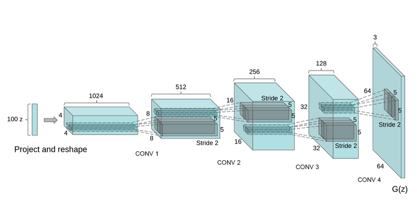

# Lands-GAN - GAN generated landscapes pictures

This project aims to generate new but photo realistic images of landscapes.

## Summary of the process

To generate these pictures, the project is using two methods one after the other:

1. DCGAN to generate small images (128x128)
2. Applying DiffAugment to DCGAN to generate better images
3. ESRGAN to scale up these images (x4) to a 512x512 dimension

## Data used

For this project, the base data has been taken on Kaggle [here](https://kaggle.com/arnaud58/landscape-pictures). This dataset contains 4,319 pictures of real-world landscape. All images are stored in a JPG format, and they are from different sizes, most common being 1024x1060. Width and height distribution can be seen with the [ImageDimensions.ipynb](./Scripts/ImageDimensions.ipynb) juputer notebook.

So here, we have a quite small dataset. Indeed, most of deep learning models require a huge amount of data to work well (tens of thousands are generaly good). GANS are no exception. But we can still try to train DCGAN to generate landscapes.

## Detailed method

### DCGAN to generate the landscapes images

For this landscape generator the "base" architecture used is DCGAN. DCGAN stands for Deep Convolutional Generative Adversarial Network. It is a direct extension of the the Generative Adversarial Network proposed by [[1]](#1)

The schematized architecture of DCGAN is shown just bellow (taken from [[2]](#2)):

We can see here that DCGAN works with a random noise vector as input (100x1x1) (marked as z on the figure), and through a projection and 4 classical convolution layers, the network outputs a tensor of 64x64x3, corresponding to an image (64 pixels for width and height, and 3 channels for RGB).

According to [[2]](#2), even with a very small number of epochs (5), the result seems for a first look quite satisfying. Here, we will train for 100 epochs each time, for the results to be comparable.

The biggest backdraw of DCGAN in my opinion is that the size of the output image is hard-coded, in the architecture of the network. With the original version of DCGAN, output images are limited to 64x64 pixels.

Thanks to a small trick found [here](https://github.com/pytorch/examples/issues/70), one can understand easily how to increase the size of the output images. The main modification to do is to add a classical transposed convolution layer after the last layer, expanding the output to 128x128. Many transposed convolution could be applied, to increase the size of the output, but as explained in the same thread, the larger the problem is (meaning the generation of the output), the harder it is to get a stable game between the generator and the discriminator. This will be easily seen in the [Results](#results) section. This is the reason why the two architectures of DCGAN (that outputs 64x64 and 128x128 images) where kept and run in parallel.

### Differentiable Augmentation

As seen in the [data](#data-used) section, the dataset used cannot be considered as very large. A commonly used possibility in that case is to use data augmentation (for each picture, applying an horizontal flip, adjust hue, brightness and contrast for example). However, as shown in [[3]](#3), classical means of data augmentation do not work very well for GANs, simply because the goal of a generative model is to learn the data distribution itself, and not just a label in the case of a classification task for instance.

Fortunately, some methods have been developped to reproduce the effects data augmentation has on other models for GANs. The method choosen here is called *DiffAugment* for *Differentiable Augmentation*. The method proposed in [[4]](#4), allows an efficient data augmentation for GAN training. After some test presented in the paper, the authors have arrived to the conclusion that the data augmentation shall be done both on the real and the fake samples, and that the generator should not neglect the augmented samples (for it loss calculation). The authors proposed three policies usable for their data augmentation method, that can be used together for one given sample.

1. Translation: a simple translation of the image (within \[ -1/8, 1/8 \]), padded with zeros
2. Cutout: masking with a random square of half the image size
3. Color: random brightness within \[ -0.5, 0.5 \], contrast within \[ 0.5, 1.5 \] and saturation within \[ 0, 2 \]

According to their experiments, the best result occurs when the three policies are used together, so that is what I am doing here.

### ESRGAN

The output of DCGAN is quite small, either 64x64 pixels or 128x128 pixels. It is a very small image, even more on the 15" 4k screens that one can have nowadays. To compensate this problem, a quite recent network seems particularly adapted: ESRGAN [[5]](#5). ESRGAN stands for Enhanced Super-Resolution Generative Adversarial Networks. It is a direct improvement of the SRGAN (Super-Resolution GAN). This network gives excellent results on a task that was considered as very hard before: increasing the size of an image without getting a poor quality. The classical algorithm used for this task is bilinear or bicubic interpolation. But these methods results in blurred and poor quality images in general if the upscale is too important.

The main improvement of ESRGAN and SRGAN compared to other deep learning methods to resolve this task known as super-sampling is the introduction of a perceptual loss. Most of the other models where trained using a loss based on the Mean Square Error. Here, the loss used (called perceptual loss in the SRGAN paper [[6]](#6)) is composed of a content loss and an adversarial loss.

**Content loss:** The content loss is defined as the euclidean distance between the feature representations of a reconstructed image and the reference image. This results in more satisfying solutions perceptually speaking, compared to solution proposed by a mean square error optimization problems that often lack high frequency content.

**Adversarial loss:** The adversarial loss correspond to the generative component of the GAN. It is added into the perceptual loss, and thus encourage to favor solutions near natural images, by trying to fool the discriminator network. It is based on the probabilities of the discriminator answering correctly over all training samples.

## Implementations

### DCGAN

* To implement the basis of DCGAN (meaning the network that outputs 64x64 images, without DiffAugment), I used the tutorial given on the [Pytorch website](https://pytorch.org/tutorials/beginner/dcgan_faces_tutorial.html).
* To implement the idea of adding a transposed convolution layer at the end of the network, I used the help given on that [GitHub thread](https://github.com/pytorch/examples/issues/70).

### Differentiable Augmentation

To add DiffAugment for my dataset, I used the code on the GitHub repository of the authors of the Differentiable Augmentation paper, found [here](https://github.com/mit-han-lab/data-efficient-gans).

### ESRGAN

To implement the ESRGAN, I also used the GitHub repository of the authors, found [here](https://github.com/xinntao/Real-ESRGAN).

## Results

Work in progress...

## References

<a id="1">[1]</a> Goodfellow et al., 2014, Generative Adversarial Networks

<a id="2">[2]</a> Radford et al., 2016, Unsupervised Representation Learning with Deep Convolutional Generative Adversarial Networks

<a id="3">[3]</a> Tran et al., 2021, On Data Augmentation for GAN Training

<a id="4">[4]</a> Zhao et al., 2020, Differentiable Augmentation for Data-Efficient GAN Training

<a id="5">[5]</a> Wang et al., 2018, ESRGAN: Enhanced Super-Resolution Generative Adversarial Networks

<a id="6">[6]</a> Ledig et al., 2017, Photo-Realistic Single Image Super-Resolution Using a Generative Adversarial Network
